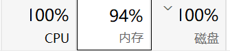

# 考核总结

答辩结束了，算是终于完成了一项任务吧，尽管在考核以及答辩之中的表现并不是很好。因为项目是vibe出来的，又隔了半个多月，我跟我的考核项目感觉是两个陌生人，只能根据原来写的文档去重新熟悉。答辩时有点紧张，还有对很多知识点不是很熟悉，所以被拷打时总是磕磕绊绊的，无法准确描述出自己的想法。也算是确实认识到了自己在语言表达上存在的一定缺陷和相关知识点的不熟悉。稍微总结一下我的考核和答辩吧，认识自己的不足。

## 关于项目

考核任务是从4月26号发出的（大概），因为快要劳动节了，所以我也啥心思开始写项目。放假那段时间去了上海参加了星铁land（ps：去当纯净米孝子了😋）。

回来之后，也没直接开始写，对选题犹豫了一段时间后，因为我觉得对agent方面的知识太少了，所以最终还是决定选择更偏向后端开发的aim。在考核之前我并未纯粹使用过vibe进行开发，大多时候都是在网页直接问，使用的是古法编程。项目开始时我都是用的古法编程，我最开始想的是全部古法就把项目写完，但是及其低下的效率，让我在考核接近过半时也只是将群组和好友功能做了出来，不得已我去使用copilot，但是copilot又在砍学生优惠，不仅没几个模型可用，能用的感觉也是降智严重，而codex和claude对我来说又太贵了，跟本用不起，所以有段时间一直在捏着鼻子用copilot，那段时间真的是每次ai输出的结果我都要全部看完（ps：因为一开始ai就给我拉了一坨大的在我的代码上）。后来段神发现了trae，给我讲里面的模型调用是免费的，于是我就用上了trae，用上trae后是真的明白原来过得是什么苦日子（ps：真真切切的感受到了为什么ai正在取代程序员）。但新手保护期过了之后，trae的模型就要开始排队了，热门的像glm5.1有的时候要排到2000多位，一等就是接近半个小时，我又不想把我的项目交给豆包啥的，只有老老实实排队了，排队没事干我就刷视频，有的时候一刷就是一个多小时，然后粗略看一下ai有没有按我的想法干活，然后继续写prompt，一天基本就这么过去了。那段时间可以说是我大学之中我认为最颓废的一段时间，每天基本就是上课、写prompt、刷视频。虽然有时会对自己感到痛恨，但还是禁不住刷视频。6月初的时候，考核已经快要结束了，我才发觉自己的项目还有好多功能没有实现，我就将短视频软件设置了使用时长，让自己能够更专心完成项目。可是完成的时间并不够了，再加上智谱5.1同样有时会造shit（ps：已经彻底过了与ai的热恋期），我只有先搁置下对agent层面的扩展，先完成了考核的基本要求。后面因为期末考试也就没有再对项目进行修改。

我也看过go组那些大佬们的项目，他们项目中实现的功能和对知识的理解深度也确实让我感受到了与他们的差距越来越大，我也察觉到自己项目中有哪些应该去改进的地方。

## 关于答辩

说实话，我对答辩其实并不算上心，直到答辩前一晚才开始重新熟悉自己项目，才发现github上的文档都传错了，临时抱到臭脚了。重新修改了前端的一些问题后，docker构建镜像又出问题了

整得在挖矿一样，折磨到晚上3点过才睡，第二天醒来基本就要开始答辩了。答辩比较常规，就是演示并讲解项目，我对我选用的开发工具的理解大多比较粗显，所以基本没太记住几个专有名词，又算上有点紧张，表达时有点过于

口语化了，感觉cyjj好多次都是凭猜来理解我的意思😭。同时也给我问出来项目中的很多问题，像是图数据库的实体和块是纯规则提取，并未用上llm导致生成的知识图比较低质（ps：虽然我在答辩前发现了实体提取有问题，但是并未深究是什么原因造成）。还有在应对一些学过的知识的提问时，答得比较粗糙。当时问道我怎么让kafka保证消息可靠性，我当时想的是kafka不是本来做了可靠性吗？但是我并不知道该怎么讲出kafka是怎么实现消息可靠性的（忘了相关的知识了），当时我应该是根据记忆里还有的知识在乱讲😥，但也算学到了outbox去解决可靠消息投递。后面还发现我把考核看错了，支持用户通过 OpenAPI 自行部署机器人我看成了要用openai的模型🤣。一次答辩我感觉自己是漏洞百出，但也算知道了自己的还有很多不足和问题。

## 最后的最后

也是侥幸通过考核了😝。以后还是尽量少刷点无聊的小视频，多学点有用的知识。🤦‍♂️